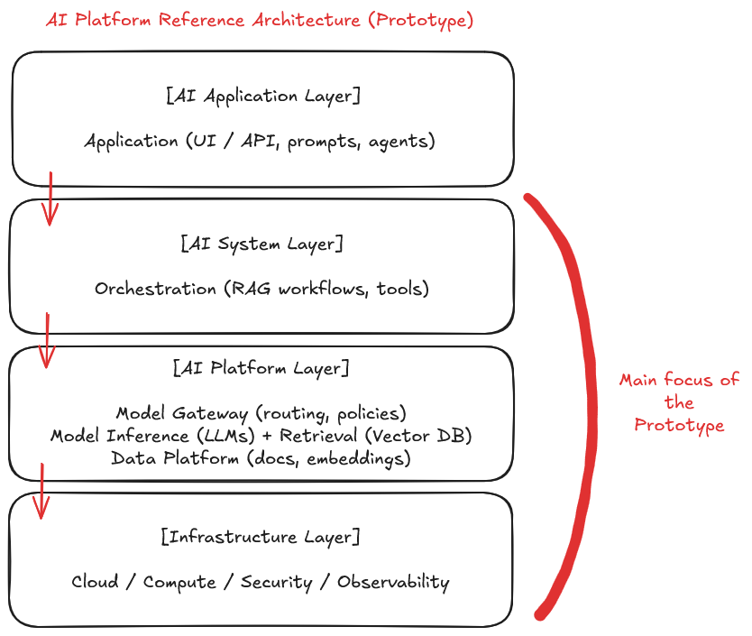

# AI Platform Reference Architecture + AI Gateway implementation

This repository contains both the reference architecture and the initial implementation of an AI Governance Gateway, which serves as the first executable component of the platform.

The reference architecture use is to set a foundation to designing and building a modern AI platform, focused on patterns such as Retrieval-Augmented Generation (RAG), orchestration, model routing, and observability.

The goal is to understand how AI systems evolve from simple applications into reusable, scalable platforms.

- docs/   → architecture and design artifacts
- app/    → gateway service implementation
- infra/  → Terraform infrastructure for GCP

---

## 🛣️ Roadmap

- [x] Reference architecture
- [x] Terraform foundation (GCP APIs, project setup)
- [ ] Gateway service (FastAPI baseline)
- [ ] Containerization (Docker)
- [ ] Cloud Run deployment
- [ ] Model integration (LLM provider)
- [ ] Observability + logging

## 🧠 Overview

Modern AI systems are increasingly structured as **distributed platforms** rather than isolated applications.

They combine multiple capabilities:

- Retrieval systems (vector databases, embeddings)
- Model inference (LLMs)
- Orchestration workflows
- Model routing and policies
- Observability and evaluation
- Governance and security

This repository explores how these components fit together in a **layered architecture**.

---

## 🏗️ Architecture

The platform is organized into four main layers:

- **AI Application Layer** → user experience, prompts, agents  
- **AI System Layer** → orchestration, RAG workflows, tools  
- **AI Platform Layer** → model routing, inference, retrieval, data platform  
- **Infrastructure Layer** → cloud, compute, security, observability  

---

## 🔑 Key Concepts

### Retrieval-Augmented Generation (RAG)
Combining LLMs with external knowledge sources to improve accuracy and grounding.

### Orchestration
Coordinating workflows between retrieval, models, and tools.

### Model Gateway / Routing
Selecting models dynamically based on cost, latency, or capability.

### Observability & Evaluation
Monitoring prompts, responses, and system behavior to improve quality and reliability.

---

## 📚 Documentation

Full reference architecture:

👉 [docs/reference-architecture.md](./docs/reference-architecture.md)

---

## 🎯 Goals

This project focuses on:

- Understanding AI platform architecture patterns
- Exploring how systems evolve from prototype → production → platform
- Designing reusable infrastructure for multiple AI use cases

---

## 🛣️ Roadmap

- Phase 1 - Platform foundation (cloud, IAM, infra)
- Phase 2 - Data platform (ingestion, embeddings)
- Phase 3 - Retrieval layer (vector search)
- Phase 4 - Model integration (inference, routing)
- Phase 5 - Orchestration (RAG workflows, tools)
- Phase 6 - Application layer (API/UI)
- Phase 7 - Observability and evaluation

See [roadmap.md](./docs/roadmap.md) for more details.

---

## 🚀 Future Work

- Agentic workflows and tool usage
- Multi-model routing strategies
- Evaluation frameworks for LLM systems
- Advanced retrieval (hybrid, graph-based)

---

## 👋 About

This repository is part of a series exploring how to design and build AI platforms from the ground up.

Follow the journey on LinkedIn: https://www.linkedin.com/in/paugonzalezr/
